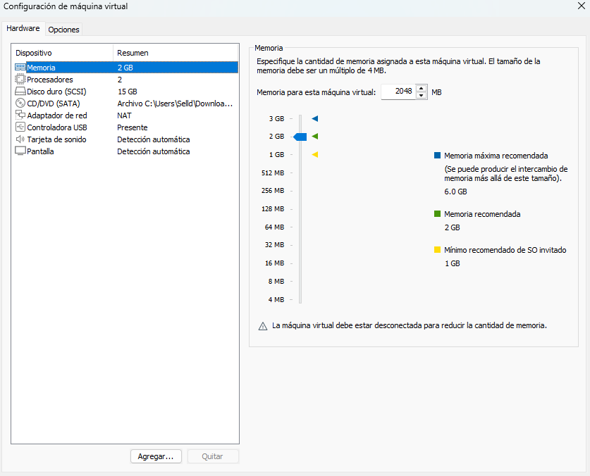

# AI-SOC-Analyst-Homelab
 
## ✅ Objective
 
This project demonstrates the deployment of an **AI-powered Security Operations Center (SOC) Triage pipeline** in a home lab environment using VMware Workstation. The lab simulates a real network attack from a Kali Linux machine targeting an Ubuntu Server, captures the malicious traffic automatically using Python and tshark, and sends structured JSON alerts to an AI agent trained with a professional SOC playbook for automated triage analysis.
 
### Skills Learned
 
- Deploying a virtualized attack/defense lab using VMware Workstation
- Configuring VMware NAT networking for inter-VM communication
- Capturing and analyzing live network traffic using tshark
- Automating threat detection with Python scripting
- Generating structured JSON security alerts from raw packet data
- Building and deploying an AI agent trained on a SOC playbook (Airia)
- Mapping detected threats to the MITRE ATT&CK framework
- Interpreting AI-generated SOC triage reports with risk scoring
---
 
## 🧰 Technologies Used
 
- **Python 3** — Automation script for traffic capture and alert generation
- **tshark 4.2.2** — CLI packet capture and analysis tool
- **Airia AI** — AI agent platform (SOC playbook trained agent)
- **Ubuntu Server 24.04.4 LTS** — Internal server (victim + detector)
- **Kali Linux 2025.4** — Attacker machine
- **VMware Workstation Pro 25H2** — Virtualization platform
- **MITRE ATT&CK** — Threat classification framework
---
 
## ⚙️ Environment Setup
 
### Virtual Machine Specifications
 
| Parameter | Ubuntu Server (Victim) | Kali Linux (Attacker) |
|---|---|---|
| OS | Ubuntu Server 24.04.4 LTS | Kali Linux 2025.4 |
| RAM | 2 GB | 2 GB |
| CPU | 2 cores | 2 cores |
| Storage | 15 GB (LVM) | 80 GB |
| Network | VMware NAT | VMware NAT |
| IP | 192.168.248.134 | 192.168.248.133 |
 
### Prerequisites
 
- VMware Workstation installed
- Ubuntu Server 24.04 ISO
- Kali Linux VMware image (.7z)
- Airia AI account with published SOC agent
- Internet access on both VMs
---
 
## 🏗️ Lab Architecture
 
```
┌─────────────────────────────────────────────────────────────┐
│                        HOST MACHINE                          │
│                      Windows 11 Pro                          │
│                                                              │
│  ┌───────────────────┐          ┌────────────────────────┐  │
│  │   Kali Linux VM   │          │   Ubuntu Server VM     │  │
│  │   192.168.248.133 │          │   192.168.248.134      │  │
│  │                   │          │                        │  │
│  │  ┌─────────────┐  │          │  ┌──────────────────┐  │  │
│  │  │ ping flood  │──┼─ICMP────►│  │ soc_capture.py   │  │  │
│  │  │ -c 200      │  │          │  │ tshark capture   │  │  │
│  │  └─────────────┘  │          │  └────────┬─────────┘  │  │
│  │                   │          │           │             │  │
│  │   ATTACKER        │          │           ▼             │  │
│  └───────────────────┘          │  ┌──────────────────┐  │  │
│                                 │  │  alert.json      │  │  │
│         VMware NAT Network      │  │  HTTP POST       │  │  │
│         192.168.248.0/24        │  └────────┬─────────┘  │  │
│                                 │           │             │  │
│                                 │   VICTIM  │  DETECTOR   │  │
│                                 └───────────┼────────────┘  │
└─────────────────────────────────────────────┼───────────────┘
                                              │
                                              ▼ Internet
                                   ┌─────────────────────┐
                                   │   Airia AI Agent    │
                                   │   SOC Playbook      │
                                   │   Triage Report     │
                                   └─────────────────────┘
```
 
| Component | Host | IP | Role |
|---|---|---|---|
| Attacker | Kali Linux 2025.4 (VMware) | 192.168.248.133 | Generates malicious ICMP traffic |
| Victim + Detector | Ubuntu Server 24.04 (VMware) | 192.168.248.134 | Captures traffic and sends alerts |
| SOC AI Agent | Airia Cloud | — | Analyzes alerts and generates triage reports |
 
---
 
## 🚀 Step 1 — Build the AI Agent on Airia
 
Sign up at [airia.ai](https://airia.ai) and create a new project. Add an AI model and create a new agent. Paste the contents of `SOC_playbook.txt` as the system prompt. Publish the agent and save the API URL and API Key.
 

 
---
 
## 🖥️ Step 2 — Deploy the Virtual Machines
 
Ubuntu Server 24.04 was deployed in VMware as the internal server. Kali Linux 2025.4 VMware image was imported directly without installation. Both VMs were configured on VMware NAT network to ensure inter-VM communication.
 
```bash
# Verify connectivity from Ubuntu to Kali
ping 192.168.248.133
 
# Expected output:
# 64 bytes from 192.168.248.133: icmp_seq=1 ttl=64 time=0.366 ms
# 20 packets transmitted, 20 received, 0% packet loss
```
 

 
---
 
## 🔧 Step 3 — Install Dependencies on Ubuntu Server
 
```bash
sudo apt update && sudo apt upgrade -y
sudo apt install tshark python3 python3-pip -y
pip3 install requests --break-system-packages
```
 
Verify tshark installation:
 
```bash
tshark --version
# TShark (Wireshark) 4.2.2
```
 

 
---
 
## 🐍 Step 4 — Deploy the Python Script
 
The automation script `soc_capture.py` was created on the Ubuntu Server with the following configuration:
 
```python
INTERFACE = "ens33"          # Network interface
CAPTURE_DURATION = 100       # Capture window in seconds
THRESHOLD = 40               # Packets to flag as suspicious
DESTINATION_IP = "192.168.248.134"
AIRIA_API_URL = "https://api.airia.ai/v2/PipelineExecution/..."
AIRIA_API_KEY = "ak-..."
```
 
### Python Code Flow
 
```
capture_traffic()
    └── tshark captures ICMP packets → traffic.pcap
 
convert_to_csv()
    └── tshark converts pcap → traffic.csv
 
analyze_traffic()
    └── Counts packets per source IP
    └── Flags IP exceeding threshold (40)
 
generate_alert()
    └── Creates structured JSON alert with UUID
 
send_to_airia()
    └── HTTP POST to Airia API
    └── Receives SOC triage report
```
 

 
---
 
## ⚔️ Step 5 — Simulate the Attack from Kali
 
From the Kali Linux VM, a ping flood was launched targeting the Ubuntu Server:
 
```bash
ping -c 200 192.168.248.134
```
 
```
200 packets transmitted, 200 received, 0% packet loss, time 201115ms
rtt min/avg/max/mdev = 0.353/1.241/42.283/3.099 ms
```
 

 
---
 
## 🤖 Step 6 — Run the SOC Script on Ubuntu
 
```bash
sudo python3 soc_capture.py
```
 
The script detected the attack automatically:
 
```
[+] Capturing on ens33 for 100s...
[+] Capture saved to traffic.pcap
[+] CSV created at traffic.csv
 
[+] Traffic volume per source IP:
  192.168.248.133: 99 packets
 
[!] Suspicious IP detected: 192.168.248.133 (99 packets)
[+] Alert JSON written to alert.json
[+] Sending alert to Airia SOC Agent...
[+] Airia responded with status 200
```
 

 
---
 
## 🛡️ Step 7 — AI SOC Triage Report
 
The Airia AI agent analyzed the alert and returned a professional SOC triage report:
 
```json
{
  "alert_id": "SOC-28FE93CD",
  "threat_classification": "Network Service Scanning",
  "risk_score": 55,
  "risk_level": "Medium",
  "confidence_level": "High",
  "mitre_mapping": {
    "tactic": "Discovery",
    "technique_id": "T1046",
    "technique_name": "Network Service Scanning"
  },
  "analysis_reasoning": "99 packets detected from external source 192.168.248.133 within a 100-second window. Packet count does not meet critical threshold due to relatively short timeframe. Activity is consistent with network scanning or reachability probing rather than benign network noise.",
  "recommended_actions": [
    "Review firewall and network logs for additional context",
    "Monitor source IP for follow-up suspicious activity",
    "Verify if ubuntu-soc-server is expected to receive this traffic",
    "Enrich with threat intelligence databases"
  ],
  "escalation_required": false,
  "executive_summary": "An internal server received a high volume of ping requests (99 packets in 100 seconds) from a single source. This pattern is consistent with network scanning behavior. The recommendation is to verify if this traffic is expected and monitor for escalation to other attack patterns."
}
```
 

 
---
 
## 🧠 SOC Playbook Summary
 
The AI agent was trained with a 10-section SOC playbook:
 
| Section | Description |
|---|---|
| 1 | Input validation — verifies required JSON fields |
| 2 | Threat classification (Brute Force, Recon, ICMP Flood, etc.) |
| 3 | Risk scoring model (0–100) with rules-based logic |
| 4 | MITRE ATT&CK mapping |
| 5 | SOC Tier 1 action plan |
| 6 | Escalation logic based on risk score |
| 7 | Executive summary in plain language |
| 8 | Strict JSON output format |
| 9 | Confidence level assignment |
| 10 | Guardrails — no attack instructions, no fabrication |
 
### Risk Scoring Rules
 
| Condition | Points |
|---|---|
| Packet count > 30 | +20 |
| Packet count > 50 | +30 |
| Packet count > 100 | +40 |
| Activity within < 60s window | +20 |
| Privileged service targeted | +20 |
| ICMP flood behavior | +15 |
| Suspicious login activity | +25 |
 
**Risk Levels:** Low (0–29) · Medium (30–59) · High (60–79) · Critical (80–100)
 
---
 
## 📁 Project Structure
 
```
AI-SOC-Analyst-Homelab/
├── screenshots/
│   ├── airia-agent.png
│   ├── kali-attack.png
│   ├── python-script.png
│   ├── soc-report.png
│   ├── script-output.png
│   ├── tshark-install.png
│   └── vm-network.png
├── soc_capture.py
├── SOC_playbook.txt
├── sample_output/
│   └── sample_alert.json
├── LICENSE
└── README.md
```
 
---
 
## ⚠️ Disclaimer
 
This project is for **educational purposes only**. All testing was performed on isolated virtual machines owned and controlled by the author. Never run network attacks against systems you do not own or have explicit permission to test.
 
---
 
## 👤 Author
 
**alexrepsec**  
Cybersecurity enthusiast | Home Lab Builder
 
*This project was built as part of a cybersecurity portfolio to demonstrate practical SOC automation, AI-powered threat detection, and network traffic analysis skills.*
 
